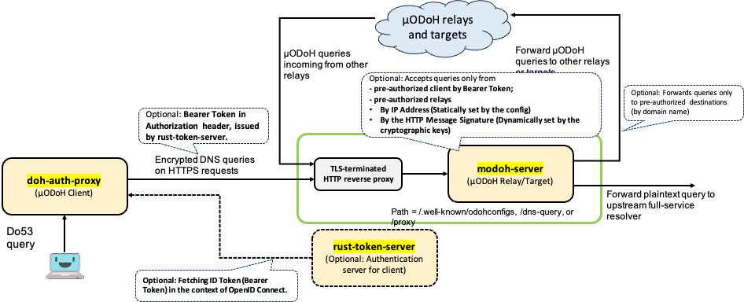

# modoh-server

[](LICENSE)


[](https://hub.docker.com/r/jqtype/modoh-server)

Relay and target implementation for Oblivious DoH (ODoH) and ODoH-based Mutualized Oblivious DNS (ODoH-based &mu;ODNS; &mu;ODoH) supporting authenticated connection, written in Rust. Standard DoH target server is also supported.

> **NOTE: This is a re-implementation of [https://github.com/junkurihara/doh-server](https://github.com/junkurihara/doh-server) for ease of maintenance and feature updates for &mu;ODNS.**

> **In &mu;ODoH, the target function is fully compatible with that of ODoH. For the detailed information on &mu;ODNS, please also refer to [https://junkurihara.github.io/dns/](https://junkurihara.github.io/dns/).**

## Introduction

*DNS over HTTPS* (DoH) is an encrypted DNS protocol in which DNS queries and responses are exchanged with the target full-service resolver via HTTPS, i.e., over an encrypted-secure channel ([RFC8484](https://datatracker.ietf.org/doc/rfc8484)). To enhance the privacy of DoH, *Oblivious DNS over HTTPS* (ODoH) has been developed  ([RFC9230](https://datatracker.ietf.org/doc/rfc9230/)). ODoH leverages an intermediate *relay* (or *proxy*) and an end-to-end encryption ([HPKE](https://datatracker.ietf.org/doc/rfc9180/)) in order to decouple the client's IP address and content of his queries. *Mutualized Oblivious DNS over HTTPS* (*&mu;ODoH) is an extension of ODoH, which has been (is still being) developed from the concern of the collusion between the relay and the target resolver and corruption of the client's privacy ([Resource](https://junkurihara.github.io/dns/)).

`modoh-server` is server software that provides the target and relay functions of these three encrypted and privacy-enhanced NDS protocols. Note that as the target function, `modoh-server` works not as the full-service resolver like `bind` and `unbound` but as the DNS forwarder decrypting encrypted queries and sends the plaintext ones to the upstream full-service resolver via UDP/TCP over port 53.

### Network structure of &mu;ODoH

Here is an example of the network architecture of &mu;ODoH.



The &mu;ODoH network consists of &mu;ODoH client ([`doh-auth-proxy`](https://github.com/junkurihara/doh-auth-proxy)), &muODoH relay and target servers(`modoh-server`), and supplementary authentication server ([`rust-token-server`](https://github.com/junkurihara/rust-token-server)). Note that when there exist two `modoh-server`, i.e., single relay and single target available, it exactly coincides with ODoH.

`modoh-server` supplementary provides several access control functions for incoming and outgoing HTTP requests: For incoming requests, it provides (1) client authentication by Bearer token and (2) acceptance of pre-authorized previous relays by their source IP address; For outgoing requests, it enforces (3) filtering requests by pre-authorized target domains. To enable the (1) client authentication, the `rust-token-server` must be configured and deployed on the Internet in addition to `modoh-server`.

## Installing/Building an Executable Binary

You can build an executable binary yourself by checking out this Git repository.

```bash:
# Cloning the git repository
% git clone https://github.com/junkurihara/modoh-server
% cd modoh-server

# Build (default: opentelemetry is enabled with `otel-evil-trace`)
% cargo build --release

# If you don't need opentelemetry for server observability:
% cargo build --release --no-default-features
```

Then you have an executive binary `modoh-server/target/release/modoh-server`.

Note that if `otel-evil-trace` feature is enabled, you can track requests traveled among your modoh-server instances by propagating the trace id appended to the HTTP request header.

## Usage

`modoh-server` always refers to a configuration file in TOML format, e.g., `config.toml`. You can find an example of the configuration file, `modoh-server.toml`, in this repository.

You can run `modoh-server` with a configuration file like

```bash:
% ./target/release/modoh-server --config config.toml
```

If you specify `-w` option along with the config file path, `modoh-server` tracks the change of `config.toml` in the real-time manner and apply the change immediately without restarting the process.

The full help messages are given follows.

```bash:
% ./target/release/modoh-server --help
Relay and target for (Mutualized) Oblivious DNS over HTTPS with Authorization

Usage: modoh-server [OPTIONS] --config <FILE>

Options:
  -c, --config <FILE>                 Configuration file path like ./config.toml
  -w, --watch                         Activate dynamic reloading of the config file via continuous monitoring
  -t, --otel-trace                    Enable opentelemetry for trace. Unless explicitly specified with '-e', collector endpoint is 'http://localhost:4317'.
  -m, --otel-metrics                  Enable opentelemetry for metrics. Unless explicitly specified with '-e', collector endpoint is 'http://localhost:4317'.
  -e, --otlp-endpoint <ENDPOINT_URL>  Opentelemetry collector endpoint url connected via gRPC
  -h, --help                          Print help
  -V, --version                       Print version
```

## Basic Configuration

## Advanced Configuration

### Configuration with Access Control Mechanisms

#### Client Authentication using Bearer Token

#### Configuration of Pre-authorized Relays for Incoming Requests

#### Configuration of Pre-authorized Domains for Outgoing Requests

### Using Opentelemetry for Observability

## License
`modoh-server` is free, open-source software licensed under MIT License.

You can open issues for bugs you've found or features you think are missing. You can also submit pull requests to this repository.

Contributors are more than welcome!

Footnotes
