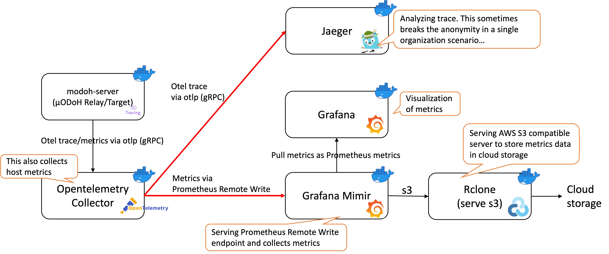

# Example Construction of Opentelemetry and its related servers for Observability

Here is an example of docker containers for the observability of `modoh-server`, conjunctively configured with its container in [`../docker/`](../docker/).

This example consists of the following containers:

- [`opentelemetry-collector`](https://github.com/open-telemetry/opentelemetry-collector):
- [`Jaeger`](https://www.jaegertracing.io/):
- [`Grafana mimir`](https://github.com/grafana/mimir):
- [`Grafana`](https://grafana.com/):
- [`Rclone`](https://rclone.org/):

For the detailed configurations for these containers, please refer to [`./docker-compose.yml`](./docker-compose.yml) and its mounting configuration files.
